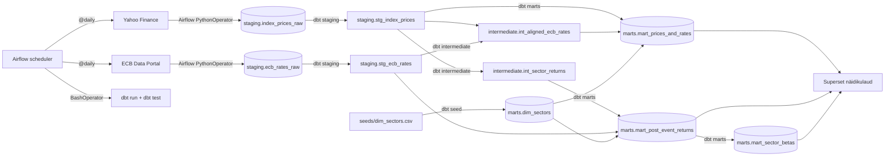

# Arhitektuur

## Äriküsimus

Kuidas on Euroopa Keskpanga(EKP) hoiustamise püsivõimaluse intressimäär seotud Euroopa erinevate sektorite indeksfondide tootlustega?

## Mõõdikud

1. Kirjeldav graafik kus on välja toodud indeksite hinnad ning intressimäärade tase vaadeldaval perioodil.
2. Sektorite keskmised 30 päeva tootlused peale intressimäära tõusu ja langust - Arvutame iga EKP intressimuutuse järel kui mitu protsenti indeks järgneva 30 päeva jooksul liigub.
3. Sektorite intressitundlikkuse beetad - Lineaarse regressiooniga hindame, kui palju liigub sektor 1 baaspunkti suuruse intressimuutuse korral.

## Andmeallikad

| Allikas | Tüüp | Ajas muutuv?                | Roll |
|---------|------|-----------------------------|------|
| Yahoo Finance | `yfinance` pythoni pakett | Jah, igal kauplemispäeval   | Sektorite indeksfondide ajalooline hinnainfo kauplemispäevadel |
| ECB Data Portal | API/XML | Jah, intressiotsuste korral | ECB hoiustamise püsivõimaluse intressimäära muutuste ajalugu |
| `seeds/dim_sectors.csv` | seed | Ei, staatiline              | STOXX Europe 600 erinevate sektorite indeksfondide sümbolid yfinance päringuteks|

## Andmevoog

## Andmebaasi kihid

| Kiht | Materiaalsus              | Roll                                                                                                           |
|------|---------------------------|----------------------------------------------------------------------------------------------------------------|
| `staging` | Tabel (raw) + Vaade (dbt) | API toorandmed ja puhastatud vaated (veerunimede, andmetüüpide korrastamine; JSON extraction; duplikaadid jne) |
| `intermediate` | Vaade (dbt)               | Vahearvutused ja analüütilised ettevalmistused.                                                                |
| `marts` | Tabel (dbt)               | Hoiab lõplikke analüütilisi mõõdikuid ja visualiseerimiseks valmis tabeleid.                                   |

Iga Airflow käivitus saab uue `run_id`. Staging kihis säilib kogu ajalugu (append-only); mart tabelid arvutatakse iga kord üle viimase ehk `MAX(run_id)` - mart tabelis sisaldub iga päeva kohta ainult üks rida.

## Tööjaotus

| Roll | Vastutus | Täitja   |
|------|----------|----------|
| Andmeallika omanik | Hoiab Airflow DAG'i töökorras, kontrollib API vastust | Argo     |
| Transformatsioonide omanik | Kirjutab ja hooldab dbt mudeleid | Kristjan |
| Kvaliteedi omanik | Kirjutab testid ja vaatab läbi ebaõnnestunud kontrollid | Kerttu   |
| Näidikulaua omanik | Ehitab näidikulaua ja seob selle äriküsimusega | Liis     |

## Riskid

| Risk | Mõju                         | Maandus                                                                                 |
|------|------------------------------|-----------------------------------------------------------------------------------------|
| API ei vasta | Airflow task ebaõnnestub     | Airflow logib vea; käivitamine kordub järgmisel tunnil automaatselt.                    |
| Indeksfondi sümbol muutub või eemaldatakse | Sektoril puuduvad uued andmed | Kontrollitakse hinnainfo tabelis andmelünkade olemasolu.                                |
| Scheduler ei käivitu | Andmed ei uuene              | Scheduler logib ebaõnnestunud käivitused ning andmevoogu saab käsitsi uuesti käivitada. |

## Privaatsus ja turve

Projekt kasutab ainult avalikke indeksfondide hinnaandmeid Yahoo Finance'ist ja Euroopa Keskpanga intressimäärasid ECB andmeportaalist. Isikuandmeid ei koguta. Andmebaasi kasutajanimi ja parool tulevad `.env` failist.
