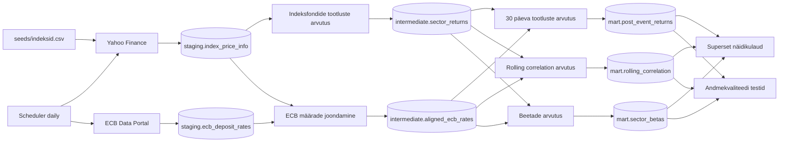

# Arhitektuur

## Äriküsimus

Kuidas on Euroopa Keskpanga hoiustamise püsivõimaluse intressimäär seotud Euroopa erinevate sektorite indeksfondide tootlustega?

## Mõõdikud

1. Sektorite keskmised 30 päeva tootlused peale intressimäära tõusu ja langust
2. Sektorite ja EKP hoiustamise püsivõimaluse intressimäära muutuste rolling korrelatsioonid
3. Sektorite intressitundlikkuse beetad

## Andmeallikad

| Allikas | Tüüp | Ajas muutuv? | Roll |
|---------|------|--------------|------|
| Yahoo Finance | `yfinance` pythoni pakett | Jah, iga kauplemispäeva | Sektorite indeksfondide ajalooline hinnainfo kauplemispäevadel |
| ECB Data Portal | API/CSV | Jah, intressiotsuste korral | ECB hoiustamise püsivõimaluse intressimäära muutuste ajalugu |
| `seeds/indeksid.csv` | seed | Ei, staatiline | STOXX Europe 600 erinevate sektorite indeksfondide sümbolid yfinance päringuteks|

## Andmevoog

## Andmebaasi kihid

| Kiht | Roll |
|------|------|
| `staging` | Hoiab lähteandmeid analüüsi jaoks. |
| `intermediate` | Vahearvutused ja analüütilised ettevalmistused. |
| `mart` | Hoiab lõplikke analüütilisi mõõdikuid ja visualiseerimiseks valmis tabeleid. |

## Tööjaotus

| Roll | Vastutus | Täitja |
|------|----------|--------|
| Andmeallika omanik | Kirjutab sissevõtu loogika, hoiab API-t töös | [Nimi] |
| Transformatsioonide omanik | Kirjutab mart kihi mudelid ja mõõdikute arvutuse | [Nimi] |
| Kvaliteedi omanik | Kirjutab testid ja vaatab läbi ebaõnnestunud kontrollid | [Nimi] |
| Näidikulaua omanik | Ehitab näidikulaua ja seob selle äriküsimusega | [Nimi] |

## Riskid

| Risk | Mõju | Maandus |
|------|------|---------|
| API ei vasta | Andmed ei uuene | Skript annab veateate, mille korral saab andmevoo käsitsi uuesti käivitada. |
| Indeksfondi sümbol muutub või eemaldatakse | Sektoril puuduvad uued andmed | Kontrollitakse hinnainfo tabelis andmelünkade olemasolu. |
| Scheduler ei käivitu | Andmed ei uuene | Scheduler logib ebaõnnestunud käivitused ning andmevoogu saab käsitsi uuesti käivitada. |

## Privaatsus ja turve

Projekt kasutab ainult avalikke indeksfondide hinnaandmeid yahoo financeist ja Euroopa Keskpanga intressimäärasid ECB andmeportaalist. Isikuandmeid ei koguta. Andmebaasi kasutajanimi ja parool tulevad `.env` failist.
